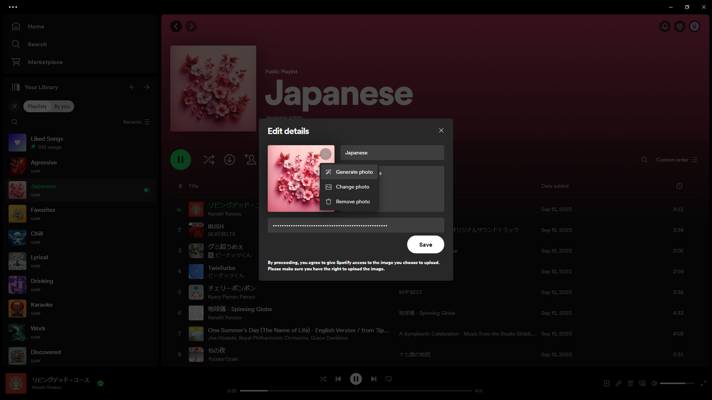

# Spicetify AI Playlist Images

Quickly generate and save playlist images using DALL·E 3. (An OpenAI API key is required.) The prompt is taken from the playlist title and playlist description. To tweak the prompt, simply change the description temporarily.

## Install
Install [Spicetify](https://spicetify.app) and install "AI Playlist Images" from the Marketplace.

## Made with Spicetify Creator
- https://github.com/spicetify/spicetify-creator